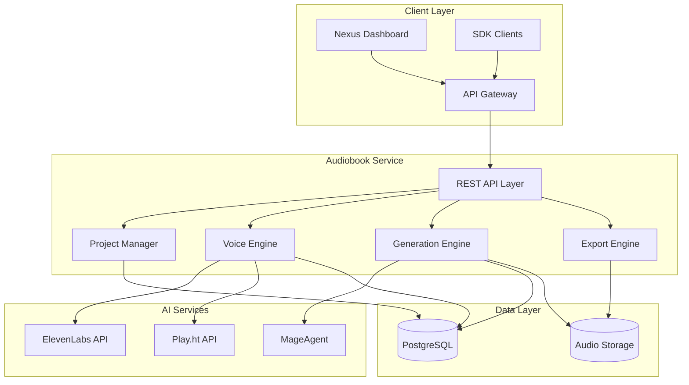
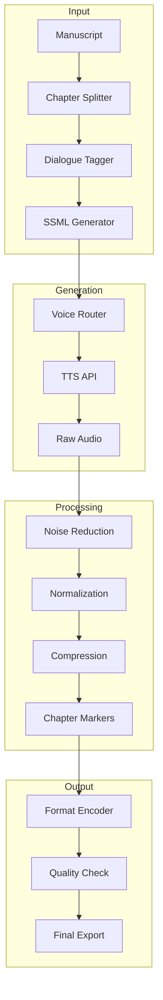
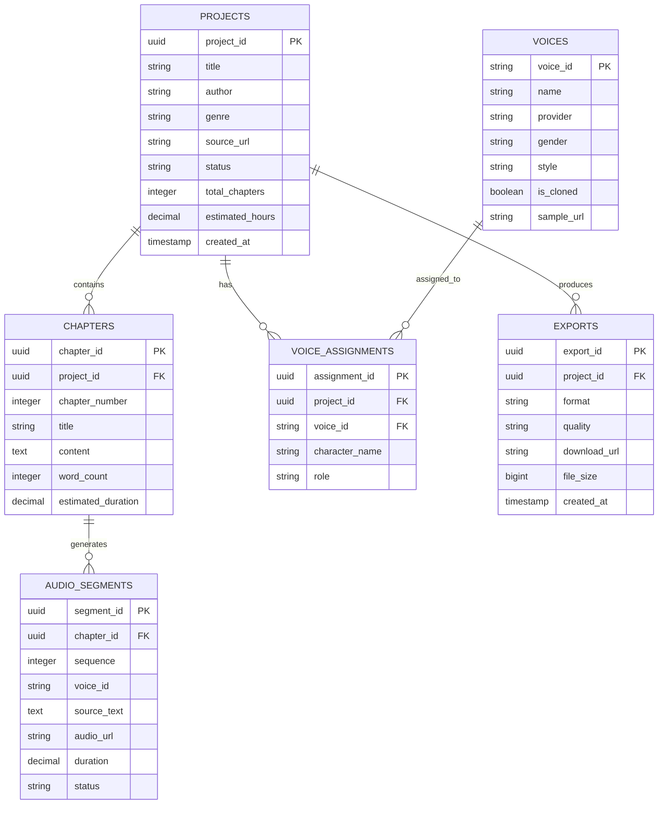
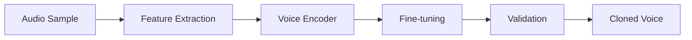

# Audiobook Architecture

Technical architecture and system design for AI-powered audiobook production.

---

## System Overview



---

## Core Components

### 1. REST API Layer

| Endpoint | Method | Description |
|----------|--------|-------------|
| `/audiobook/api/projects` | POST | Create audiobook project |
| `/audiobook/api/projects/:id` | GET | Get project details |
| `/audiobook/api/projects/:id/assign-voices` | POST | Assign voices |
| `/audiobook/api/projects/:id/generate` | POST | Start generation |
| `/audiobook/api/projects/:id/status` | GET | Get status |
| `/audiobook/api/projects/:id/download` | GET | Download audiobook |
| `/audiobook/api/voices/clone` | POST | Clone voice |
| `/audiobook/api/voices` | GET | List voices |

### 2. Project Manager

Handles audiobook project lifecycle.

**Capabilities:**
- Manuscript parsing and chapter detection
- Character extraction and dialogue tagging
- Progress tracking and estimation
- Quality assurance workflow

### 3. Voice Engine

Voice selection, matching, and cloning.

**Voice Providers:**
- ElevenLabs (primary)
- Play.ht (backup)
- Custom cloned voices

**Features:**
- Genre-based voice matching
- Character personality mapping
- Voice cloning from samples
- Consistent voice across chapters

### 4. Generation Engine

Text-to-speech generation and audio processing.

**Processing Pipeline:**


### 5. Export Engine

Multi-format audio export.

**Formats:**
- MP3 (standard)
- M4B (with chapters)
- FLAC (lossless)
- WAV (master)

---

## Audio Processing Pipeline



---

## Data Model



---

## Voice Technology

### Voice Matching Algorithm

1. **Content Analysis**: Analyze genre, tone, and style
2. **Character Profiling**: Extract character traits
3. **Voice Database Query**: Match against voice attributes
4. **Ranking**: Score by relevance and quality
5. **Preview Generation**: Create samples for review

### Voice Cloning Pipeline



**Requirements:**
- Minimum 30 seconds of clean audio
- Consent verification
- Quality threshold validation

---

## Security Model

### Authentication
- Bearer token via Nexus API Gateway
- Signed download URLs
- Rate limiting per tier

### Authorization
- Project-level access control
- Voice clone ownership
- Export access management

### Data Protection
- Audio encrypted at rest
- Secure transfer for TTS APIs
- Consent management for voice cloning

---

## Deployment Architecture

### Kubernetes Configuration

```yaml
apiVersion: apps/v1
kind: Deployment
metadata:
  name: nexus-audiobook
  namespace: nexus-plugins
spec:
  replicas: 3
  selector:
    matchLabels:
      app: nexus-audiobook
  template:
    spec:
      containers:
      - name: audiobook-api
        image: adverant/nexus-audiobook:1.0.0
        ports:
        - containerPort: 8080
        resources:
          requests:
            memory: "2Gi"
            cpu: "1000m"
          limits:
            memory: "4Gi"
            cpu: "2000m"
        livenessProbe:
          httpGet:
            path: /audiobook/api/health/live
            port: 8080
        readinessProbe:
          httpGet:
            path: /audiobook/api/health/ready
            port: 8080
```

### Resource Allocation

| Component | CPU | Memory | Storage |
|-----------|-----|--------|---------|
| API Server | 1000m-2000m | 2Gi-4Gi | - |
| Audio Processor | 2000m-4000m | 4Gi-8Gi | 50Gi |
| Worker | 500m-1000m | 1Gi-2Gi | 10Gi |

---

## Performance

### Processing Capacity

| Tier | Concurrent Jobs | Hours/Day |
|------|-----------------|-----------|
| Starter | 1 | 10 |
| Author | 2 | 50 |
| Publisher | 5 | 200 |
| Enterprise | Custom | Unlimited |

### Latency Targets

| Operation | Target |
|-----------|--------|
| Project Creation | < 5s |
| Voice Preview | < 10s |
| Chapter Generation | 2-5 min |
| Full Book (10h) | 4-8 hours |

---

## Monitoring

### Metrics (Prometheus)

```
# Generation metrics
audiobook_chapters_generated_total
audiobook_generation_duration_seconds
audiobook_audio_hours_produced

# Quality metrics
audiobook_quality_score
audiobook_regeneration_rate

# Voice metrics
audiobook_voice_clones_total
audiobook_voice_api_latency
```

### Alerting

| Alert | Condition | Severity |
|-------|-----------|----------|
| Generation Failure | >5% failure rate | Critical |
| Quality Below Threshold | Score < 0.8 | Warning |
| API Latency High | > 30s | Warning |

---

## Next Steps

- [Quick Start Guide](./QUICKSTART.md) - Get started quickly
- [Use Cases](./USE-CASES.md) - Implementation scenarios
- [API Reference](./docs/api-reference/endpoints.md) - Complete docs
